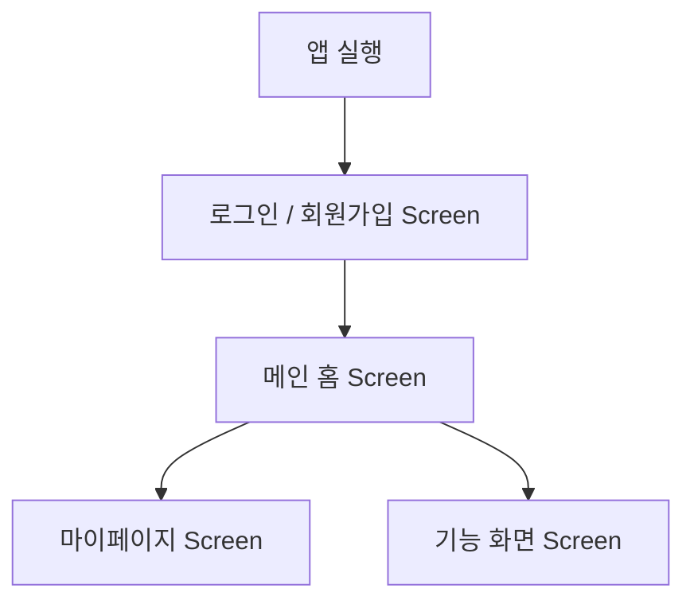

# MOA User Flow Specification

## 1. 주요 화면 및 유저 흐름

## 2. 화면 상태 정의
모든 Flutter 화면은 다음 4가지 상태를 일관되게 처리합니다:
1. Loading State (Shimmer / Progress Indicator)
2. Success State (데이터 렌더링)
3. Empty State (빈 결과 안내)
4. Error State (네트워크 실패 / 재시도 버튼)
